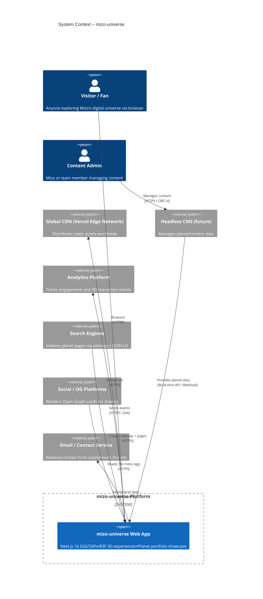
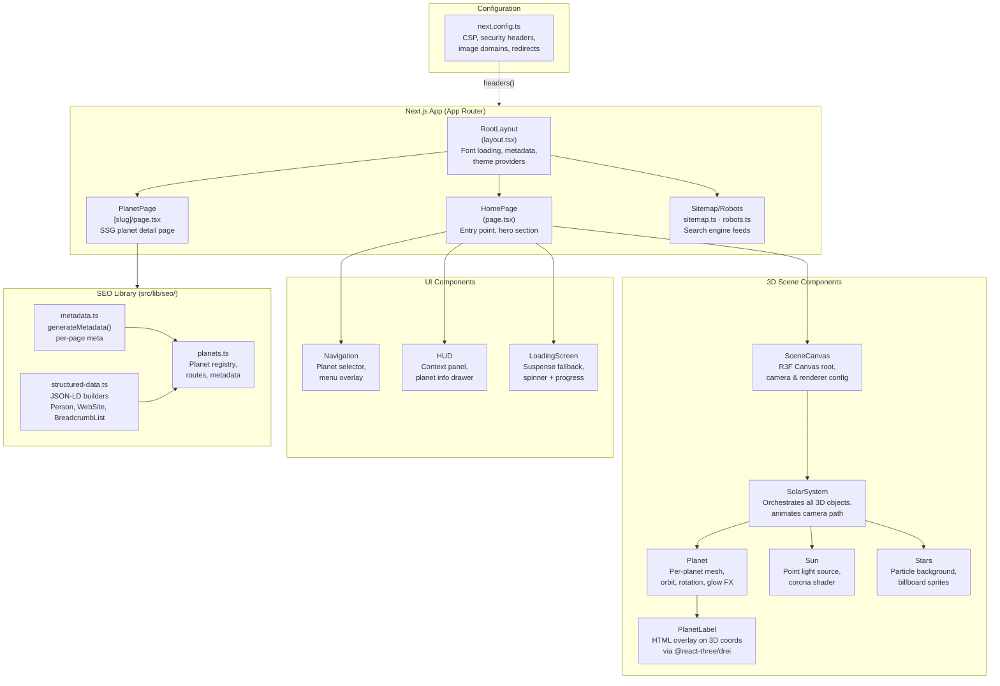
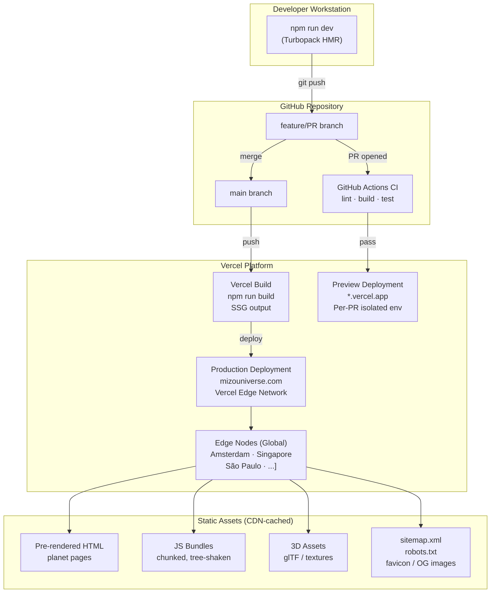
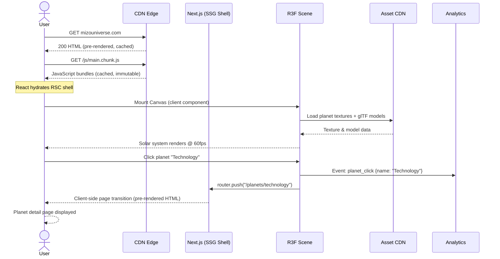
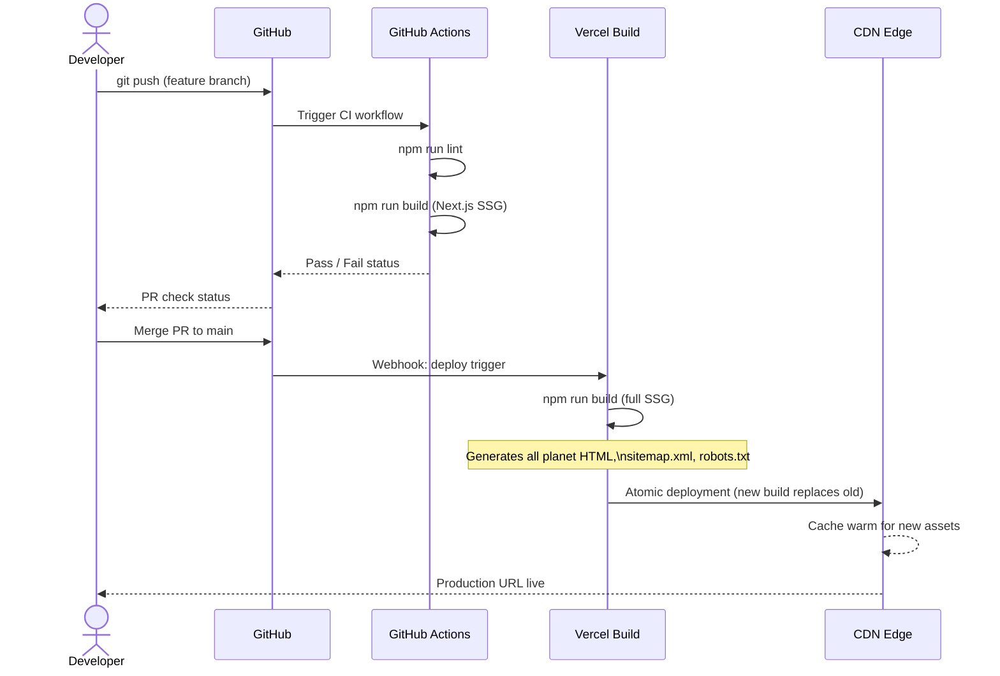
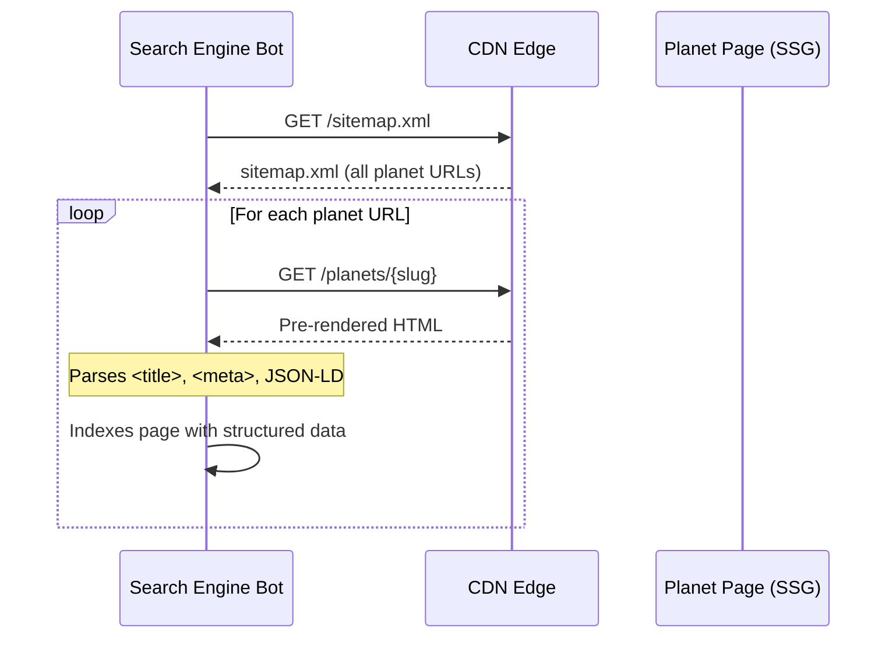
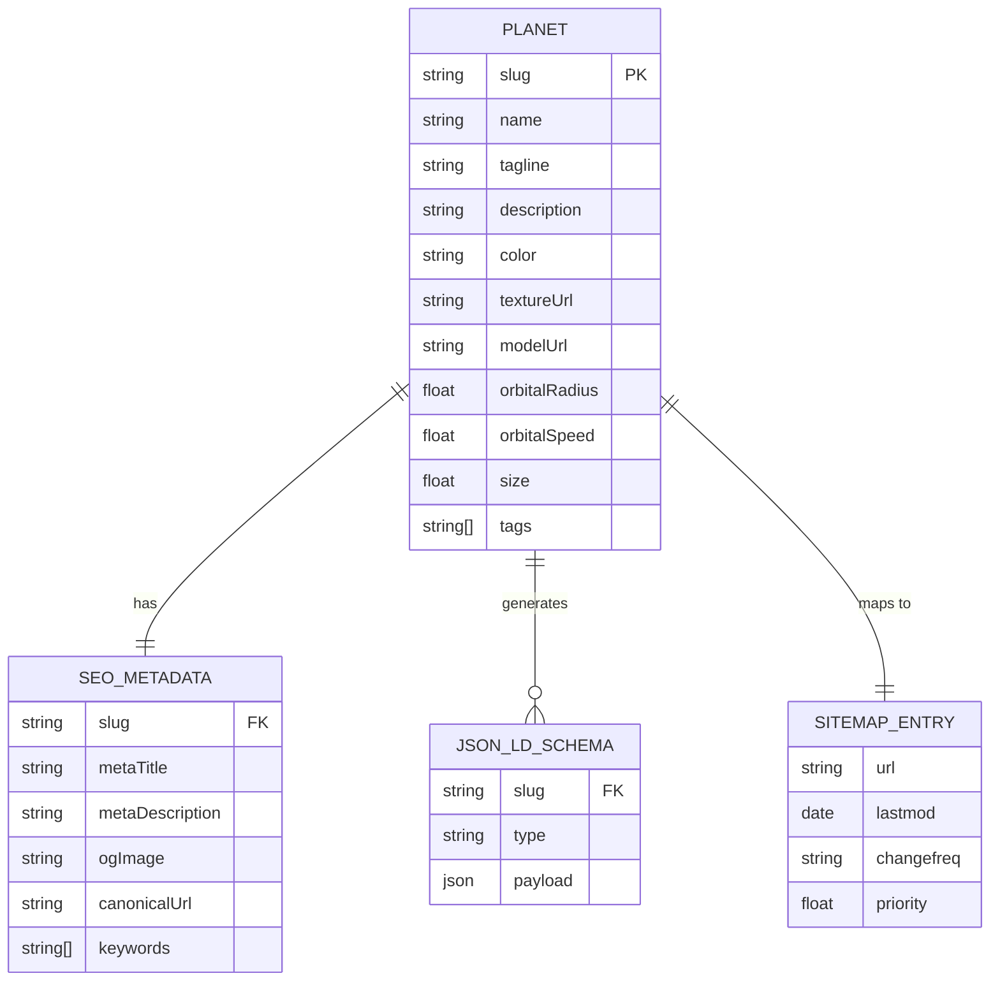
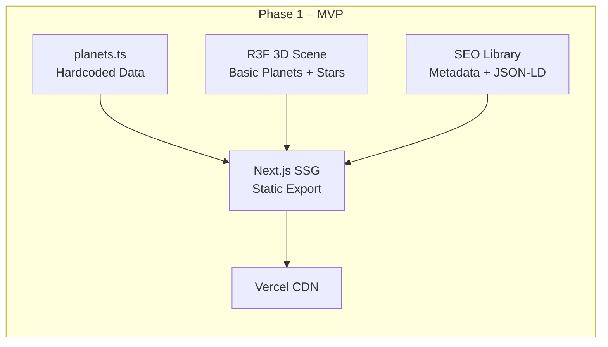
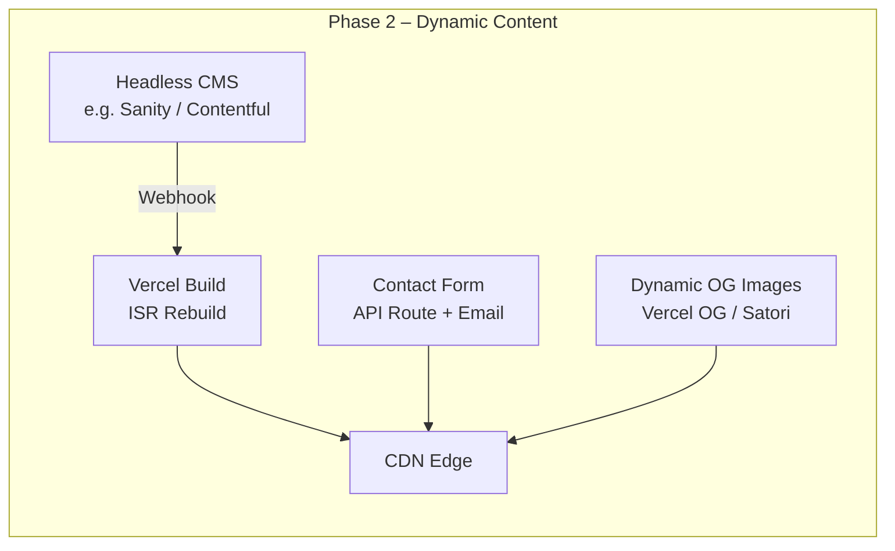
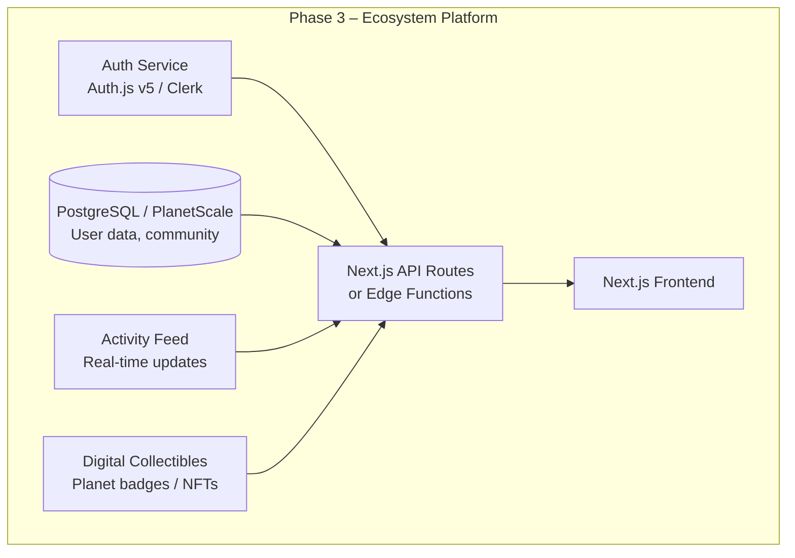

# mizo-universe – Architecture Plan

## Executive Summary

**mizo-universe** is the official digital ecosystem of Captain Mizo Amin — a hyper-realistic, interactive 3D solar system portfolio that blends sports, business, and technology into a single, immersive web experience. Each planet in the solar system represents a distinct domain of Mizo's world (e.g., sports, investments, technology ventures), allowing visitors to explore his universe by navigating between planets.

The application is built on a **Next.js 16 (App Router)** foundation with **React Three Fiber (R3F) / Three.js** for GPU-accelerated 3D rendering, deployed as a statically generated site (SSG) to a global CDN. SEO, structured data, and accessibility are first-class citizens throughout the design.

**Core Architectural Drivers:**
- Immersive, photorealistic 3D experience in the browser with no plugin requirement
- Sub-3-second Time-to-Interactive on mid-range devices
- Fully indexable by search engines (SSG + structured data)
- Zero-downtime deployments and global low-latency delivery
- Phased rollout: MVP static showcase → fully dynamic, community-driven ecosystem

---

## System Context

### Diagram



### Explanation

**Overview:** This diagram shows the mizo-universe platform in the context of its external actors and systems.

**Key Components:**
- **Visitor / Fan** – Primary user; accesses the 3D solar system via any modern browser.
- **Content Admin** – Manages planet metadata, stories, and media through a headless CMS.
- **mizo-universe Web App** – Core Next.js application; handles 3D rendering, routing, SEO, and all user interactions.
- **Global CDN** – Vercel Edge Network delivers pre-rendered HTML, static assets, and 3D models to users within ~50ms globally.
- **Headless CMS** *(future phase)* – Decouples content management from the codebase.
- **Analytics Platform** – Captures 3D interaction events (planet clicks, orbit time, etc.) for engagement insights.
- **Search Engines** – Consume the XML sitemap and JSON-LD structured data generated at build time.

**Relationships:** Visitors hit the CDN edge; the origin Next.js app only serves dynamic/ISR pages. The CMS triggers rebuilds via webhooks; analytics are pushed client-side asynchronously.

**NFR Considerations:**
- **Performance:** CDN edge caching eliminates origin round-trips for the majority of traffic.
- **Security:** All external communication is over HTTPS; CSP headers prevent XSS.
- **Scalability:** Stateless SSG means horizontal scaling is implicit via CDN replication.

---

## Architecture Overview

mizo-universe follows a **Jamstack / Static-First** architecture with progressive enhancement:

| Layer | Technology | Pattern |
|-------|-----------|---------|
| Frontend | Next.js 16 App Router | File-based routing, RSC + Client Components |
| 3D Engine | React Three Fiber + Three.js | Scene graph, per-frame refs, GPU rendering |
| Styling | Tailwind CSS | Utility-first, dark-by-default cosmic theme |
| SEO | `src/lib/seo/` (custom) | Metadata API, JSON-LD, dynamic OG images |
| Build | Turbopack (dev), Next.js build (prod) | SSG planet pages + ISR for dynamic content |
| Deployment | Vercel / Static host | Zero-config CI/CD, preview environments |
| Content | Headless CMS (future) | Webhook-triggered rebuilds |

Key patterns:
- **Island Architecture** – Heavy 3D canvas is a client-only island; surrounding layout is server-rendered for fast FCP.
- **Per-frame ref pattern** – All Three.js animation values use `useRef` instead of `useState` to avoid React re-renders in `useFrame`.
- **SSG + ISR** – Planet pages are statically generated at build time; ISR allows incremental updates without full rebuilds.

---

## Component Architecture

### Diagram



### Explanation

**Overview:** Component architecture organized into four layers — App routing, 3D scene, UI overlays, and SEO utilities.

**Key Components:**

| Component | Responsibility |
|-----------|---------------|
| `RootLayout` | Global HTML shell, font loading (local/self-hosted to avoid googleapis.com in sandbox), theme, global metadata |
| `SceneCanvas` | R3F `<Canvas>` root; configures camera FOV, renderer tone-mapping, and pixel ratio |
| `SolarSystem` | Orchestrates planet positions (ecliptic angles), camera animation path, and overall scene lifecycle |
| `Planet` | Individual planet mesh with orbital animation; uses `useRef` for per-frame rotation to prevent re-renders |
| `Sun` | Central light source; corona particle effect; drives global illumination |
| `Stars` | 10,000+ billboard particles for deep-space background |
| `planets.ts` | Single source of truth for planet slugs, display names, routes, and SEO metadata |
| `next.config.ts` | Security headers (CSP, HSTS, X-Frame-Options), image optimization config |

**Design Decisions:**
- **Separation of 3D and UI**: 3D canvas lives in its own subtree; UI overlays use CSS `position: fixed` / `absolute` to composite on top, keeping concerns isolated.
- **`useRef` over `useState` for animation values**: Prevents React reconciler overhead in the 60fps render loop.
- **Central planet registry**: `planets.ts` drives routing, sitemap generation, and metadata — single source of truth, no duplication.

**NFR Considerations:**
- **Performance**: Client-component boundary isolates the heavy R3F bundle from the server-rendered HTML shell. Code-splitting ensures the 3D engine is only loaded when the canvas mounts.
- **Maintainability**: Adding a new planet requires a single entry in `planets.ts`; all routes, sitemap, and SEO are derived automatically.
- **Reliability**: `<Suspense>` wraps the 3D canvas; users see a loading screen rather than a blank page while the WebGL context initializes.

---

## Deployment Architecture

### Diagram



### Explanation

**Overview:** A fully automated CI/CD pipeline from local development to global edge distribution.

**Key Components:**
- **Turbopack dev server**: Fast local HMR; Turbopack compiles modules incrementally, giving sub-100ms refresh cycles even for the Three.js bundle.
- **GitHub Actions CI**: Runs `npm run lint` and `npm run build` on every PR, blocking merges on failure.
- **Vercel Preview Deployments**: Each PR gets an isolated preview URL — stakeholders can review 3D changes before merging.
- **Vercel Production Edge**: SSG output is distributed to 40+ edge PoPs; cache-control headers ensure long-lived caching of immutable assets.

**Deployment Strategy:**
- Static assets (JS bundles, textures, HTML) are fingerprinted and cached with `Cache-Control: max-age=31536000, immutable`.
- HTML pages use `Cache-Control: s-maxage=86400, stale-while-revalidate` for ISR.
- Zero-downtime: new deployments become active atomically; previous deployment serves traffic until the new one is warm.

**Security Zones:**
- Public internet → CDN Edge (TLS 1.3 termination, DDoS mitigation)
- CDN Edge → Origin (internal Vercel network, mTLS)
- No persistent server process in Phase 1 (pure static); attack surface is minimal.

**NFR Considerations:**
- **Scalability**: Stateless SSG means CDN absorbs traffic spikes without autoscaling configuration.
- **Reliability**: Vercel SLA: 99.99% uptime; CDN redundancy across multiple PoPs means regional failures are transparent to users.
- **Security**: CSP, HSTS, and X-Frame-Options headers applied globally via `next.config.ts`.

---

## Data Flow

### Diagram

```mermaid
flowchart TD
    A([Build Time]) --> B[planets.ts\nPlanet Registry]
    B --> C[generateStaticParams\nRoute enumeration]
    B --> D[generateMetadata\nPer-page HTML meta + OG]
    B --> E[generateSitemapEntries\nsitemap.xml]
    B --> F[JSON-LD Builders\nstructured-data.ts]

    C --> G[(Static HTML Pages\n/planets/[slug])]
    D --> G
    E --> H[(sitemap.xml)]
    F --> G

    subgraph Runtime["Runtime (Browser)"]
        I([User visits URL]) --> J[CDN Edge\nserves pre-rendered HTML]
        J --> K[React Hydration\nApp Router RSC → Client]
        K --> L[R3F Canvas Mount\nWebGL context init]
        L --> M[Asset Loading\nglTF models · textures]
        M --> N[Scene Render Loop\nuseFrame @ 60fps]
        N --> O{User Interaction\nplanet click / hover}
        O -->|Navigate| P[Next.js Router\nclient-side transition]
        O -->|Hover| Q[HUD Update\nplanet info panel]
        P --> R[Planet Detail Page\npre-rendered HTML]
        N --> S[Analytics Event\nfire-and-forget]
        S --> T[(Analytics Platform)]
    end

    G --> J
    H --> U([Search Engine Crawler])
```

### Explanation

**Overview:** Two distinct data flow phases — **build time** (static generation) and **runtime** (browser interaction).

**Build-Time Flow:**
1. `planets.ts` is the single authoritative data source — an array of planet descriptors (slug, name, color, description, SEO metadata).
2. Next.js calls `generateStaticParams()` to enumerate all planet routes; calls `generateMetadata()` to produce per-page `<head>` content.
3. `sitemap.ts` reads `planets.ts` to emit all canonical URLs.
4. `structured-data.ts` builds JSON-LD `Person`, `WebSite`, and `BreadcrumbList` schemas embedded in each page.
5. Output: a folder of static HTML files + a `sitemap.xml`.

**Runtime Flow:**
1. Browser requests a URL → CDN serves cached HTML instantly (TTFB < 100ms).
2. React hydrates the server-rendered shell; client components (3D canvas, nav, HUD) mount.
3. Three.js assets (glTF models, HDR environment maps, planet textures) are loaded asynchronously with `<Suspense>` showing a loading screen.
4. The `useFrame` render loop runs at 60fps; planet positions are updated via `useRef` mutations (no React state updates in the hot path).
5. User interactions trigger client-side navigation (no full page reload) or HUD state updates.
6. Analytics events are dispatched asynchronously and do not block the render loop.

**NFR Considerations:**
- **Performance**: Critical path (HTML → hydration → interactive) is optimized by SSG; heavy assets are lazy-loaded after FCP.
- **Security**: No user-supplied data is rendered server-side; planet data is a static registry. No SQL injection or XSS vectors in Phase 1.
- **Maintainability**: All data flows from `planets.ts`; changing a planet name propagates to routing, SEO, sitemap, and UI automatically.

---

## Key Workflows

### Workflow 1: First Visit – Planet Exploration



### Workflow 2: Build & Deploy – Content Update



### Workflow 3: Search Engine Indexing



### Explanation

**Workflow 1 – First Visit:** The critical user journey. SSG ensures the browser receives meaningful HTML before JavaScript executes (good for FCP). The 3D canvas mounts after hydration; asset loading is deferred to avoid blocking interactivity.

**Workflow 2 – Deploy:** Atomic Vercel deployments guarantee zero downtime. The CI gate prevents broken builds from reaching production.

**Workflow 3 – SEO Indexing:** Because pages are pre-rendered with full HTML (not SPA shell), search engine bots can crawl and index content without JavaScript execution. JSON-LD structured data is embedded in each planet page's `<head>`.

---

## Entity Relationship Diagram – Data Model



### Explanation

**Overview:** The logical data model at build time. There is no runtime database in Phase 1 — all data is static and code-defined in `planets.ts`.

- **PLANET**: Core entity. Drives 3D scene (texture, model, orbital parameters) and content (name, description).
- **SEO_METADATA**: Derived from PLANET; used by `generateMetadata()` to populate `<head>` tags.
- **JSON_LD_SCHEMA**: Structured data payloads embedded per-page for rich search results.
- **SITEMAP_ENTRY**: URL entries for the XML sitemap; priority and changefreq guide crawler behavior.

---

## Phased Development

### Phase 1: MVP – Static Solar System Showcase

**Goal:** Deliver a visually stunning, SEO-optimized portfolio that demonstrates Mizo's brand with minimal infrastructure.



**Phase 1 Scope:**
- ✅ Interactive 3D solar system (planets orbit, clickable, labeled)
- ✅ Planet detail pages (static HTML, full SEO)
- ✅ Sitemap + robots.txt
- ✅ Security headers (CSP, HSTS)
- ✅ Responsive design (mobile fallback for WebGL)
- ✅ Analytics integration (page views + planet interaction events)
- ❌ CMS (content hardcoded)
- ❌ Contact/forms
- ❌ User accounts
- ❌ Dynamic content

### Phase 2: Content Management & Dynamic Features

**Goal:** Enable Mizo's team to update content without code changes; add interactivity.



**Phase 2 Additions:**
- Headless CMS for planet content (descriptions, media, news)
- Webhook-triggered ISR rebuilds on content change
- Contact form with email integration (Resend / SendGrid)
- Dynamic Open Graph image generation per planet
- Internationalization (i18n) for multi-language support

### Phase 3: Community & Ecosystem Platform

**Goal:** Transform the portfolio into a living ecosystem with community features.



**Phase 3 Additions:**
- User authentication and profiles
- Community features (comments, reactions on planet pages)
- Personalized "My Universe" dashboard
- Digital collectibles / achievements
- Real-time event feeds (Mizo's activities, news)
- Partner integrations (sports analytics, business dashboards)

### Migration Path

| Milestone | From | To | Key Change |
|-----------|------|----|-----------|
| Phase 1 → 2 | Hardcoded `planets.ts` | CMS-driven data | Add CMS, update data fetching to `fetch()` at build time + ISR |
| Phase 1 → 2 | Static OG images | Dynamic OG via Satori | Add `/api/og` route |
| Phase 2 → 3 | Stateless SSG | Stateful API + DB | Add `next-auth`, PostgreSQL, API routes |
| Phase 2 → 3 | No users | Authenticated users | Session management, RBAC |
| Phase 3 | Single region | Multi-region | Database read replicas, Edge middleware |

---

## Non-Functional Requirements Analysis

### Scalability

| Dimension | Phase 1 | Phase 2 | Phase 3 |
|-----------|---------|---------|---------|
| Traffic | CDN absorbs unlimited static traffic | ISR + CDN; rebuild on content change | Horizontal API scaling via Edge Functions |
| Content | Add planet = deploy | Add planet via CMS = ISR rebuild | Real-time via WebSockets / SSE |
| Geography | Global CDN (40+ PoPs) | Same | Multi-region DB replicas |
| 3D Complexity | Fixed scene | + Dynamic planet media | + User-customized scenes |

The architecture is designed to scale **at the CDN layer** first (cheapest, most reliable). API-layer scaling is deferred to Phase 3 when there is actual dynamic workload.

### Performance

**Targets:**
- LCP (Largest Contentful Paint): < 2.5s on 4G mobile
- FID / INP: < 100ms
- CLS: < 0.1
- WebGL frame time: < 16ms (60fps) on mid-range GPU

**Optimizations:**
- SSG eliminates server compute on the critical path
- Three.js bundle is code-split and lazy-loaded after FCP
- `useRef` instead of `useState` in the render loop (no React reconciliation in hot path)
- Textures compressed with KTX2 / Basis Universal for GPU-native decompression
- `next/image` with AVIF/WebP for 2D assets
- `<Suspense>` boundary shows loading UI while 3D assets stream in
- Google Fonts are self-hosted / loaded locally (no external googleapis.com dependency)

### Security

**Controls in Place (Phase 1):**
- **CSP (Content Security Policy)**: Restricts script, style, and WebGL shader sources
- **HSTS**: Forces HTTPS for all connections
- **X-Frame-Options: DENY**: Prevents clickjacking
- **X-Content-Type-Options: nosniff**: Prevents MIME sniffing
- **No user input in Phase 1**: No attack surface for injection
- **Dependency scanning**: GitHub Dependabot + npm audit in CI

**Phase 3 Additional Controls:**
- OAuth 2.0 / OIDC for authentication (Auth.js v5)
- CSRF tokens on all mutating API routes
- Rate limiting on API routes (Vercel Edge Middleware)
- Row-level security in PostgreSQL
- Secrets management via Vercel environment variables (never in code)

### Reliability

| Mechanism | Detail |
|-----------|--------|
| CDN Redundancy | 40+ global PoPs; regional failure is transparent |
| Atomic Deployments | Vercel flips traffic to new build atomically; no partial deploys |
| No SPOF in Phase 1 | Pure static; no database, no runtime server to fail |
| Suspense Fallbacks | 3D canvas failure (WebGL not supported) shows graceful fallback UI |
| CI Gate | Broken builds never reach production |
| Monitoring | Vercel Analytics + external uptime monitor (e.g., BetterUptime) |

**Target SLA:** 99.95% monthly uptime for Phase 1 (limited by Vercel SLA).

### Maintainability

- **Single source of truth** (`planets.ts`): One file drives routing, SEO, sitemap, and 3D scene configuration
- **TypeScript throughout**: Compile-time safety for planet data shapes and component props
- **Component isolation**: 3D scene, UI overlays, and SEO utilities are independent layers
- **Linting + formatting**: ESLint + Prettier enforced in CI (`npm run lint`)
- **Documented architecture** (this file): Onboarding new contributors takes < 1 day
- **Environment parity**: Vercel preview deployments for every PR mean "works on my machine" issues are eliminated

---

## Risks and Mitigations

| # | Risk | Likelihood | Impact | Mitigation |
|---|------|-----------|--------|-----------|
| R1 | WebGL not supported (older devices / browsers) | Medium | High | Detect WebGL support; show 2D fallback (static hero image + CSS animation) |
| R2 | 3D asset bundle too large → slow load on mobile | High | High | Compress textures (KTX2), LOD models, lazy-load after FCP, show loading progress |
| R3 | SEO – Google doesn't index planet pages correctly | Low | High | SSG (pre-rendered HTML), JSON-LD structured data, sitemap submission to GSC |
| R4 | CDN cache stale after content update | Medium | Medium | Short `s-maxage` for HTML (86400s), immutable fingerprinting for JS/assets; purge on deploy |
| R5 | Security header breaks 3D shaders (CSP) | Medium | High | Tune CSP to allow `unsafe-eval` for GLSL only in specific domains; test in CI |
| R6 | Single planet registry → all features coupled | Low | Medium | Validate schema in TypeScript; add CMS in Phase 2 to decouple content from code |
| R7 | Vercel vendor lock-in | Low | Medium | Next.js export mode enables self-hosting on any static host (S3 + CloudFront) |
| R8 | Dependency vulnerabilities (Three.js, R3F) | Medium | Medium | Dependabot auto-PRs, weekly `npm audit`, pin major versions |

---

## Technology Stack Recommendations

| Category | Recommended Technology | Rationale |
|----------|----------------------|-----------|
| Framework | Next.js 16 (App Router) | SSG, ISR, RSC, built-in image/font optimization, large ecosystem |
| 3D Engine | React Three Fiber + Three.js | Declarative R3F API over Three.js; `@react-three/drei` for helpers (OrbitControls, Html labels) |
| 3D Helpers | @react-three/drei, @react-three/postprocessing | Bloom, depth of field, environment maps out of the box |
| Styling | Tailwind CSS | Utility-first, purged at build, cosmic dark-mode theme trivial to implement |
| Animation | Framer Motion (UI) + useFrame (3D) | Framer for page transitions; useFrame for 60fps 3D animation |
| SEO | Custom `src/lib/seo/` | Already implemented; covers metadata, JSON-LD, sitemap |
| Analytics | Vercel Analytics / Plausible | Privacy-friendly, zero-config with Vercel deployment |
| CMS (Phase 2) | Sanity.io | Real-time collaboration, GROQ queries, webhook support, generous free tier |
| Auth (Phase 3) | Auth.js v5 (formerly NextAuth.js) | First-class Next.js support, OAuth providers, adapter for PostgreSQL |
| Database (Phase 3) | PlanetScale (MySQL) or Neon (PostgreSQL) | Serverless-friendly, branching for schema migrations |
| Email (Phase 2) | Resend | Simple API, React email templates, generous free tier |
| Monitoring | Vercel Analytics + Sentry | Core Web Vitals from Vercel; error tracking from Sentry |
| CI/CD | GitHub Actions + Vercel | Lint/build in GHA; preview + production deploys via Vercel |

---

## Next Steps

### Immediate (Phase 1 Completion)
1. **3D Asset pipeline**: Define texture compression pipeline (KTX2 via `toktx`) for planet textures to hit < 5MB total asset budget.
2. **WebGL fallback**: Implement `<NoSSR>` wrapper with 2D fallback for unsupported browsers; test on Safari iOS.
3. **Performance audit**: Run Lighthouse CI in GitHub Actions; fail PR if LCP > 3s.
4. **CSP tuning**: Audit CSP header against Three.js shader requirements; document allowed origins.
5. **SEO validation**: Submit sitemap to Google Search Console; validate JSON-LD with Rich Results Test.

### Short-Term (Phase 2 Preparation)
6. **CMS evaluation**: Prototype Sanity.io integration; define content schema matching `planets.ts` structure.
7. **Dynamic OG images**: Implement `/api/og` route using Vercel OG / Satori for per-planet Open Graph previews.
8. **i18n planning**: Define locale strategy (Arabic + English for Mizo's audience); evaluate `next-intl`.

### Long-Term (Phase 3)
9. **Auth design**: Define user journey for community features; select OAuth providers (Google, Apple, Twitter).
10. **Database schema**: Design user, achievement, and activity tables; plan migration strategy from stateless to stateful.
11. **Real-time architecture**: Evaluate WebSockets (Ably, Pusher) vs. Server-Sent Events for activity feed.
12. **Security review**: Engage third-party penetration testing before Phase 3 launch.
